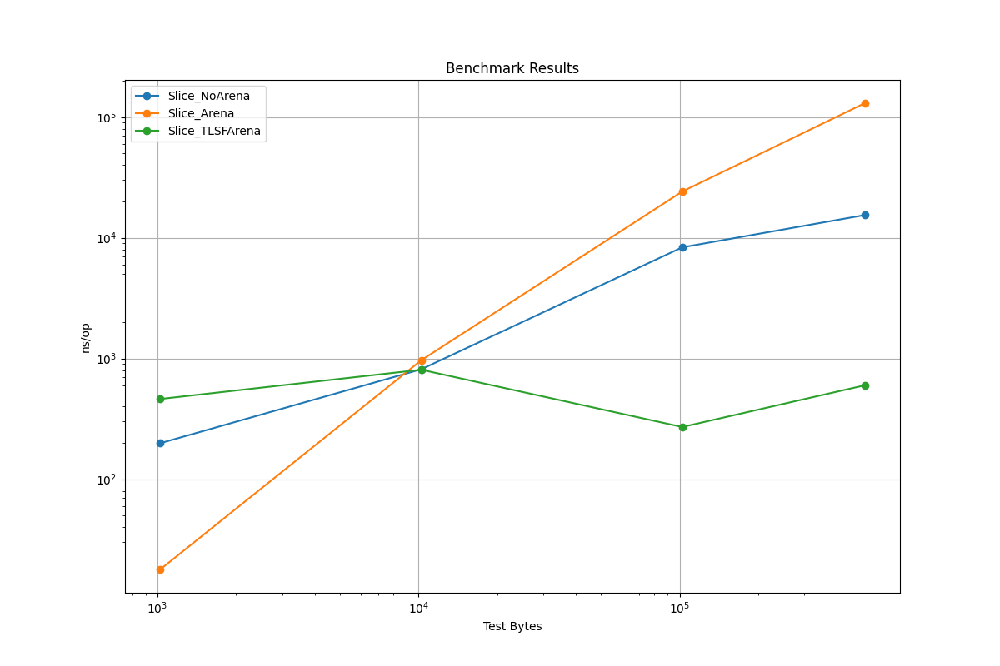

# tlsf-go

tlsf-go is a Go implementation of the Two-Level Segregated Fit memory allocator.

- This implementation is based on the TLSF algorithm from [http://www.gii.upv.es/tlsf/](http://www.gii.upv.es/tlsf/).
- It uses the [arena](https://go.dev/src/arena/arena.go) package, which is experimental in Go 1.22.
- The allocator provides fast memory allocation and deallocation, suitable for real-time systems.

## ⚠️IMPORTANT

- This implementation is experimental and may not be suitable for production use.
- This package is NOT goroutine-safe.

## Example

```go

func Example() {
	const bytes32KB uint32 = 32 * 1024
	arena := NewArena(bytes32KB)

	ptr, err := arena.Allocate(460)
	if err != nil {
		panic(err)
	}

	fmt.Printf("used_size: %d byte", arena.UsedSize())

	arena.Free(ptr)

	arena.Dispose()
	// Output: used_size: 512 byte
}
```

## Build

```shell
GOEXPERIMENT=arenas go build -tags goexperiment.arenas
```

## Testing

```shell
go test .  -tags goexperiment.arenas
```

## Benchmarks

### Benchmark environment

```shell
$ go test -bench  . -benchmem -benchtime=1000x -cpu=1 -tags goexperiment.arenas
```

- MacBook Pro (13-inch, M1, 2022)
- macOS Sonoma 14.5（23F79）
- CPU Apple M2 8-Core / Memory 24GB
- go1.22.5 darwin/arm6

### Benchmark Results




```
goos: darwin
goarch: arm64
pkg: tlsf
BenchmarkSlice_NoArena/testBytes=1024         	    1000	       198.5 ns/op	    1024 B/op	       1 allocs/op
BenchmarkSlice_NoArena/testBytes=10240        	    1000	       812.9 ns/op	   10240 B/op	       1 allocs/op
BenchmarkSlice_NoArena/testBytes=102400       	    1000	      8322 ns/op	  106496 B/op	       1 allocs/op
BenchmarkSlice_NoArena/testBytes=512000       	    1000	     15390 ns/op	  516096 B/op	       1 allocs/op
BenchmarkSlice_Arena/testBytes=1024           	    1000	        17.88 ns/op	       0 B/op	       0 allocs/op
BenchmarkSlice_Arena/testBytes=10240          	    1000	       964.9 ns/op	    8257 B/op	       0 allocs/op
BenchmarkSlice_Arena/testBytes=102400         	    1000	     24132 ns/op	   99090 B/op	       0 allocs/op
BenchmarkSlice_Arena/testBytes=512000         	    1000	    129998 ns/op	  520224 B/op	       0 allocs/op
BenchmarkSlice_TLSFArena/testBytes=1024       	    1000	       461.4 ns/op	 1024000 B/op	       0 allocs/op
BenchmarkSlice_TLSFArena/testBytes=10240      	    1000	       806.0 ns/op	 1024000 B/op	       0 allocs/op
BenchmarkSlice_TLSFArena/testBytes=102400     	    1000	       270.5 ns/op	 1024000 B/op	       0 allocs/op
BenchmarkSlice_TLSFArena/testBytes=512000     	    1000	       598.8 ns/op	 1024000 B/op	       0 allocs/op
PASS
ok  	tlsf	0.625s
```

## Author

Yuki Kogawara(warawara28)

